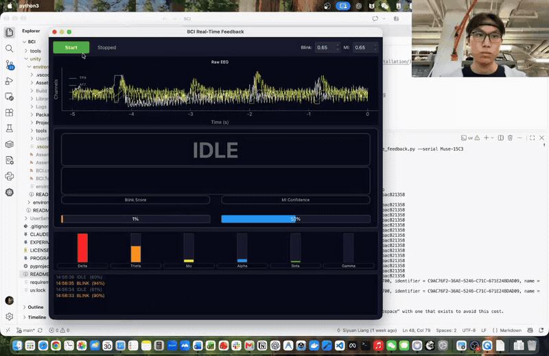
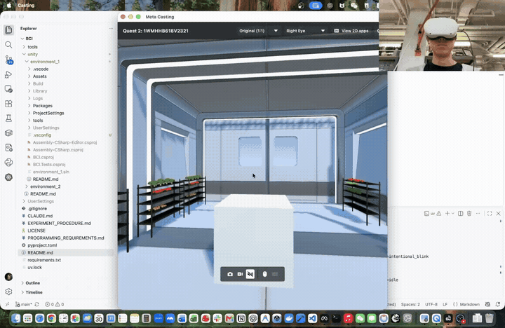

# BCI-VR Navigation Control

EEG-based control system for VR navigation using the Muse 2 headband. Decodes left/right motor imagery and intentional blinks from 4-channel EEG to enable hands-free VR navigation in Unity — no physical controllers required.

## Demos

**Real-time brainwave decoding** — EEG, band powers, and model feedback.

[](https://www.youtube.com/watch?v=xWrw_kHVDX8)

[Watch on YouTube](https://www.youtube.com/watch?v=xWrw_kHVDX8)

**VR navigation** — Quest indoor navigation and prediction output.

[](https://www.youtube.com/watch?v=tk2hOVV74W4)

[Watch on YouTube](https://www.youtube.com/watch?v=tk2hOVV74W4)

## Control Scheme

| Brain Signal | Action in `FreeNavScene` | Historical offline accuracy |
|---|---|---|
| Left motor imagery | Rotate left | ~61% |
| Right motor imagery | Rotate right | ~61% |
| Intentional blink | Detected; interaction not yet mapped | **88.7%** |
| Idle / baseline | No action | — |

## Hardware

- **Muse 2 headband** — 4 dry EEG electrodes at 256 Hz via Bluetooth
- **Channels:** TP9 (left temporal), AF7 (left frontal), AF8 (right frontal), TP10 (right temporal)
- **Interface:** BrainFlow SDK

## Quick Start

```bash
# 1. Setup (Python 3.11; install uv first: https://docs.astral.sh/uv/getting-started/installation/)
uv sync --python 3.11

# 2. Get the recorded data (NOT committed to this repo)
#    Download the Muse_Data zip from Google Drive, then unzip into data/:
#    https://drive.google.com/drive/folders/1bHQ3Cm5NYfPvOb-EGZXeE6YcODsiLqth?usp=sharing
unzip ~/Downloads/Muse_Data-*.zip -d data/
# See data/README.md for the expected layout.

# 3. (Optional) Collect new data — requires a Muse headband
#    --serial: Muse Bluetooth name (Muse-15C3 or Muse-12A6)
#    Omit --serial to get an in-app device selection screen
uv run python src/pilot_data_collection/psychopy_recording/muse_psychopy_recording_structured.py --name test --number 9 --serial Muse-15C3

# 4. Train classifiers
uv run python all_ml_models/realtime_feedback/train_and_save_models.py

# 5. Run real-time feedback
uv run python all_ml_models/realtime_feedback/realtime_feedback.py              # with Muse
uv run python all_ml_models/realtime_feedback/realtime_feedback.py --serial Muse-15C3  # specific Muse
uv run python all_ml_models/realtime_feedback/realtime_feedback.py --simulate   # without hardware

# Optional: check the Muse connection by recording 10 seconds to temp/
uv run python src/pilot_data_collection/stream_save_muse.py
# Select a specific headband if more than one Muse is nearby:
uv run python src/pilot_data_collection/stream_save_muse.py --serial Muse-15C3
```

## Run the Unity Navigation System

With the Muse 2 on and the Quest app running `FreeNavScene`, connect the Quest
over USB and forward its prediction socket:

```bash
adb reverse tcp:8765 tcp:8765
```

From the repository root, start live EEG inference with the existing model:

```bash
uv run python -m pipeline realtime \
  --model ml_pipeline/models/realtime_models.pkl \
  --skip-personalize \
  --serial 15C3 \
  --mi-threshold 0.70 \
  --blink-threshold 0.85
```

### Wireless Quest connection

1. Put the Mac and Quest on a network where the Quest can reach the Mac. Find
   the Mac's IP with `ipconfig getifaddr en0` (use the active network interface
   if `en0` is not connected).
2. In Unity, open `Assets/Scenes/FreeNavScene.unity` and select the XR Origin's
   `PredictionWebSocketClient`. Set **Host** to the Mac's IP and leave **Port**
   at `8765`, then build and install the APK on the Quest. Rebuild if the Mac's
   IP changes.
3. Run live inference on the Mac with the WebSocket bound to the network:

   ```bash
   uv run python -m pipeline realtime \
     --model ml_pipeline/models/realtime_models.pkl \
     --skip-personalize --serial 15C3 \
     --mi-threshold 0.70 --blink-threshold 0.85 \
     --ws-host 0.0.0.0
   ```

   `0.0.0.0` is the server's bind address, not the address to enter in Unity.
   Allow inbound Python connections through the Mac firewall if prompted. The
   prediction socket is unencrypted and unauthenticated, so use a trusted
   network.

`--serial` accepts either `15C3` or `Muse-15C3`. An explicit `--model` needs no
`--participant`. The included model is a legacy two-class bundle for left/right
turns; forward/backward movement needs a compatible four-class model.

`--mi-threshold 0.70` requires at least 70% model confidence before recognizing
a motor imagery direction. You can adjust it; the default is 0.55. It also
applies to the included left/right model.
`--blink-threshold 0.85` requires at least 85% blink probability before
recognizing an intentional blink; the default is 0.60.

The Python server sends at most one valid navigation command every 3 seconds.
The scene moves for up to 0.5 seconds after an accepted frame; unstable,
low-confidence, stale, or disconnected input does not sustain movement.

## System Architecture

Desktop feedback workflow (accuracy figures refer to the historical offline evaluation below). The Quest workflow streams predictions from `eeg_to_meta` over WebSocket port `8765` to Unity's `PredictionWebSocketClient` and `FreeNavController`.

```
┌─────────────────┐     ┌──────────────────┐     ┌─────────────────┐
│  Muse 2 EEG     │────>│  BrainFlow SDK   │────>│  Processing     │
│  4ch @ 256 Hz   │ BT  │  Ring Buffer     │     │  Pipeline       │
└─────────────────┘     └──────────────────┘     └────────┬────────┘
                                                          │
                        ┌─────────────────────────────────┤
                        │                                 │
                 ┌──────▼───────┐               ┌────────▼────────┐
                 │ Blink Detect │               │ Motor Imagery   │
                 │ LDA, 500ms   │               │ RF, 3s window   │
                 │ 88.7% acc    │               │ ~61% acc        │
                 └──────┬───────┘               └────────┬────────┘
                        │                                 │
                        └─────────────┬───────────────────┘
                                      │
                              ┌───────▼───────┐
                              │  PyQt6 GUI    │
                              │  Real-time    │
                              │  Feedback     │
                              └───────────────┘
```

### Three Layers

1. **Hardware / Streaming** — BrainFlow interface for Muse 2. Streams EEG to CSV or rebroadcasts over multicast for multiple consumers.

2. **Experiment / Recording** — PsychoPy-based visual cue paradigm with threaded background EEG collection. Produces paired CSVs per session (raw EEG + trial log). See [Experiment Procedure](EXPERIMENT_PROCEDURE.md).

3. **Analysis / ML** — Signal processing (MNE bandpass/notch filtering, artifact removal), feature extraction (band power, Hjorth, CSP, time-frequency), and classification (LDA, SVM, RF). Three pipeline versions tested across 4 subjects.

## Project Structure

```
pipeline/                              # Collection, training, personalization, realtime CLI
ml_pipeline/                           # Models and feature pipeline used by Quest inference
eeg_to_meta/                           # Muse acquisition and prediction WebSocket server
unity/environment_1/                   # Indoor Quest navigation and collection scenes

all_ml_models/
  training/                             # Offline ML training pipelines
    bandpower/
      train_motor_imagery.py            #   v1: band power + Hjorth + CSP
    timefreq/
      train_motor_imagery_v2_timefreq.py  # v2: + time-frequency features
    eegnet/
      train_motor_imagery_v3_eegnet.py  #   v3: + EEGNet-inspired features
  realtime_feedback/                    # Real-time feedback system
    train_and_save_models.py            #   Train & save models for real-time use
    realtime_feedback.py                #   PyQt6 GUI with live classification
  train_blink_detector.py              # Blink detection pipeline
  models/
    realtime_models.pkl                # Trained model bundle for real-time use

src/
  signal_processing/
    eeg_filters.py                     # MNE-based bandpass, notch, artifact removal
  pilot_data_collection/               # Pilot EEG data collection scripts
    psychopy_recording/
      muse_psychopy_recording_structured.py  # Data collection experiment
    stream_save_muse.py                # Basic Muse streaming to CSV
    rebroadcast_producer.py            # Multicast EEG streaming (producer)
    rebroadcast_consumer.py            # Multicast EEG streaming (consumer)
    muse_eeg_gui.py                    # Legacy PyQt6 GUI (superseded)
  realtime_monitoring/
    stream_realtime_bandpower.py       # Live band power computation
    visualize_data_live.py             # Real-time EEG + band power plots

data/                                  # Downloaded from Google Drive — see data/README.md
  README.md
  Muse_Data/
    Phase1/sub{NN}/                    # Per-subject session
      eeg_data_YYYYMMDD_HHMMSS.csv     #   Raw EEG (timestamp + 4 channels)
      trial_log_YYYYMMDD_HHMMSS.csv    #   Trial metadata
      metadata.yaml
    Phase2/sub{NN}/                    # Repeat sessions (currently sub03, sub05)

data_analysis/                         # See data_analysis/README.md
  _common.py                           #   Shared discovery + loading helpers
  raw/                                 #   Per-subject raw-signal views
    generate.py                        #     plot_01/02/04
  signal_level/                        #   PSD + band power, per/cross-subject
    generate.py                        #     plot_03/06/07/08 + cross_subject_*
  ml/
    results.md                         #   Classification results write-up
```

## Data Collection

The PsychoPy workflow records two CSVs per session:

**EEG data** — continuous 4-channel EEG with timestamps aligned to BrainFlow's session clock:
```
timestamp, marker_code, marker_label, EEG_0(TP9), EEG_1(AF7), EEG_2(AF8), EEG_3(TP10)
```

**Trial log** — one row per trial with consistent schema:
```
trial_id, trial_type, label, start_time, end_time, event_marker, duration, session_id
```

Trial types: `motor_imagery_left`, `motor_imagery_right`, `blink_intentional`, `baseline_quiet`, `baseline_active`

Motor imagery epochs are interval-based (cue onset to spacebar press, 2–5s). Blink epochs are event-centered (500ms window around button press).

## Classification Results

Historical evaluation: 4 subjects (sub02–sub05), 77 MI epochs, 190 blink epochs. Full breakdown in [`data_analysis/ml/results.md`](data_analysis/ml/results.md).

### Blink Detection

| Evaluation | Config | Classifier | Accuracy |
|---|---|---|---|
| Within-subject | all 4 channels | LDA | **88.7%** |
| Cross-subject (LOSO) | all 4 channels | LDA | **86.0%** |

### Motor Imagery (Left vs Right)

| Evaluation | Pipeline | Config | Classifier | Accuracy |
|---|---|---|---|---|
| Within-subject | v1 Band Power | all 4 channels | SVM-rbf | **61.0%** |
| Cross-subject (LOSO) | v3 EEGNet | temporal only | RF | **62.2%** |

Three feature pipelines were compared:
- **v1** — Band power + Hjorth + lateralization asymmetry + CSP
- **v2** — v1 + sliding-window time-frequency (ERD/ERS dynamics)
- **v3** — v2 + EEGNet-inspired fixed spatial/temporal features

Key findings: Blink detection outperformed motor imagery in this offline evaluation. Motor imagery is near chance with 4 subjects — needs more data or paradigm refinement. These scores do not establish live Quest performance.

The newer saved [pipeline evaluation](ml_pipeline/results/training_results.json) includes 11 subject IDs, 54 MI epochs, and 565 blink epochs. Random Forest MI scores are 52.39% within-subject and 45.66% LOSO; LDA blink scores are 89.41% and 82.07%, respectively. These are binary MI/blink offline results, not four-class navigation results.

## Real-Time Feedback System

The real-time GUI (`all_ml_models/realtime_feedback/realtime_feedback.py`) provides live brain state feedback:

- **Blink detection** — 500ms sliding window, LDA classifier, ~1s cooldown
- **Motor imagery** — 3s sliding window, Random Forest with CSP features
- **Band powers** — live delta/theta/mu/alpha/beta/gamma visualization
- **Raw EEG** — 4-channel waveform display (last 5 seconds)

Adjustable confidence thresholds via the GUI. Blink detection has priority over motor imagery each update cycle (5 Hz).

## WebSocket System

The WebSocket connection carries model predictions from Python to Unity so
EEG processing runs on the computer while navigation runs on the Quest.
Raw EEG stays in the Python pipeline; the prediction socket sends class labels,
confidence scores, and pipeline state events.

| Socket | Direction | Purpose |
|---|---|---|
| `8765` — predictions | Python → Unity | Navigation predictions and lifecycle events |
| `8766` — markers | Unity → Python | Trial markers and run/session boundaries during data collection |

[`JsonWSServer`](eeg_to_meta/websocket_server.py) broadcasts one UTF-8 JSON
message per WebSocket frame to connected clients. Unity's
[`PredictionWebSocketClient`](unity/environment_1/Assets/Scripts/PredictionWebSocketClient.cs)
connects to `ws://<host>:8765` and passes predictions to `FreeNavController`.
With automatic connection enabled, it retries disconnected connections every
2 seconds. See [Run the Unity Navigation System](#run-the-unity-navigation-system)
above for USB and Wi-Fi setup.

### Prediction Messages

Example left-turn prediction:

```json
{
  "type": "prediction",
  "timestamp": 1711234567.89,
  "predicted_class": "left_motor_imagery",
  "confidence": 0.93,
  "raw_probs": {"left": 0.93, "right": 0.07},
  "stable": true,
  "key_hint": "LeftArrow"
}
```

- **Class and confidence** — `predicted_class` identifies the action; `confidence` is a score from 0 to 1. Legacy left/right labels rotate the player; compatible four-class models add `mi_forward`, `mi_backward`, `mi_rotate_left`, and `mi_rotate_right`.
- **Stability and timing** — navigation predictions must be stable and meet the confidence threshold. The server sends at most one navigation command every 3 seconds and omits `idle` frames. Unity rejects stale timestamps and stops movement when an accepted command expires.
- **Diagnostics** — `raw_probs` contains per-class probabilities. `key_hint` is advisory; navigation uses the class label directly, without injecting keyboard input.
- **Pipeline state** — messages with `type: "state"` report lifecycle transitions such as `personalizing_start`, `personalizing_end`, and `realtime_ready` separately from predictions.

### Test Without Muse EEG

After configuring the Quest connection, run the synthetic prediction server
from the repository root:

```bash
uv run python unity/environment_1/tools/smoke_predictions.py
# For Wi-Fi, add: --host 0.0.0.0
```

Wait for `Quest connected`, then enter `forward`, `backward`, `left`, or `right`.
Use `low` and `unstable` to check that rejected predictions do not move the
player. This checks transport and Unity movement independently of EEG decoding.
Enter `q` before starting live inference; both servers use port `8765`.

### Keyboard Shortcuts

| Key | Action |
|---|---|
| Space | Start / stop classification |
| Q | Quit |

## Preprocessing Pipeline

Desktop MI preprocessing is applied per-channel:

1. NaN/Inf sanitization
2. Moving artifact removal (rolling z-score, 3-sigma threshold, 0.5s window)
3. Linear detrend
4. Notch filter (60 Hz powerline removal)
5. Bandpass filter (1–40 Hz, 4th-order Butterworth)

The Quest runtime uses separate MI (1–40 Hz) and blink (0.5–10 Hz) bandpasses, with 2-second MI and 0.5-second blink windows; see [`eeg_to_meta/config.py`](eeg_to_meta/config.py).

## Dependencies

Dependencies are declared in `pyproject.toml` and resolved in `uv.lock`. Install them with `uv sync --python 3.11`.

- `brainflow` — EEG acquisition
- `mne` — Signal filtering
- `scikit-learn` — ML classifiers
- `PyQt6`, `pyqtgraph` — Real-time GUI
- `psychopy` — Experiment paradigm
- `numpy`, `scipy`, `pandas` — Numerics
- `torch` — EEGNet features (v3 pipeline only)

## Team

| Name | Role |
|---|---|
| Alan Wu | Algorithm design, full-stack development |
| Michelle | Hardware / electronics integration |
| Spencer | Software development |
| Ashee | Research, HCI, user studies |

Cornell CUXR Lab
